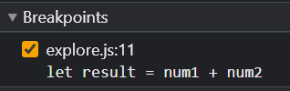
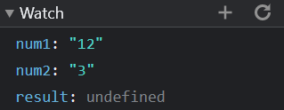
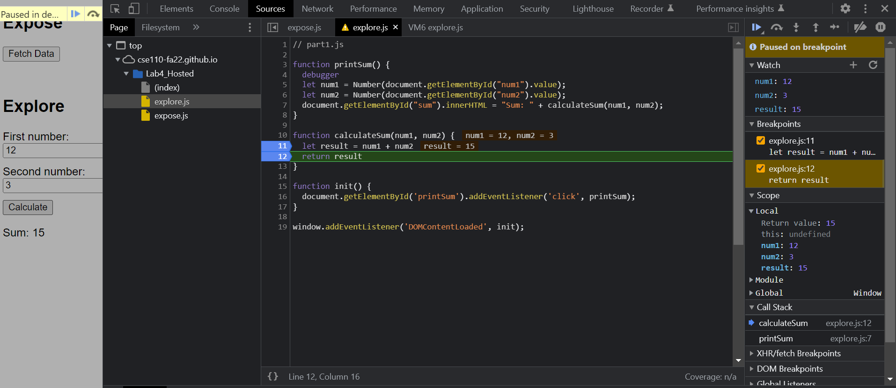

### Question 1
The bug was caused by lines 5 and 6. In these lines, num1 and num2 were typed as strings, leading to them being concatenated instead of added later on in the code.\

  
 
### Question 2
To fix this, one can use the `Numbers()` function and throw the right hand side of lines 5 and 6 into the function. It should convert the numbers to integers and they can be added correctly. 

